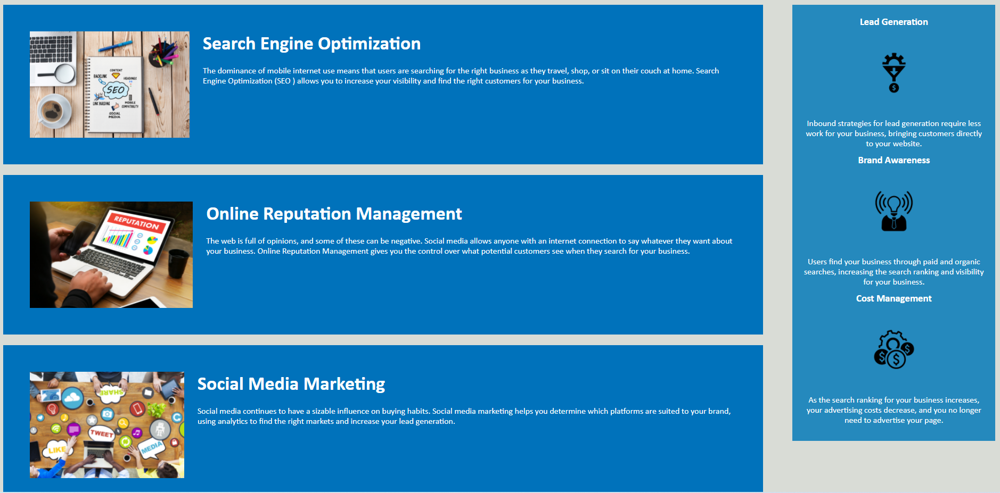

# Title: CS-horiseon-code-refactor

### {Horiseon code refactor project}

 

## Our Mission:

Here at Horiseon we strive to be the best in Search Engine Optimization,
Online Reputation Management, and Social Media Marketing! Bring your
designs into the 21st century with style and efficiency working hand-in-hand to provide the best web experience for your consumers.

 

## The Task:

We have been hired too optimize and refactor Horiseon's webpage and code for an upcomming product launch that is expected to increase their userbase and create more travel on their site. In addition we will be replacing non-semantic code with semantic-elements to make the database cleaner, easier to read, and easier to edit in the future. At the end of this project our goal is to present a BETTER experience for Horiseon's growing userbase though a stream lined wedpage with a familiar look we all know and love.

 

### Links:

Deployed: https://smithcray.github.io/cs-horiseon-code-refactor/

GitHub: https://github.com/SmithCray/cs-horiseon-code-refactor

 

 

### Author: **Cray Smith**

 

GitHub Link:

https://github.com/SmithCray

Email:

cmsmith004@gmail.com

 

Copyright (c) [2021] [Cray Smith]

#

Permission is hereby granted, free of charge, to any person obtaining a copy
of this software and associated documentation files (the "Software"), to deal
in the Software without restriction, including without limitation the rights
to use, copy, modify, merge, publish, distribute, sublicense, and/or sell
copies of the Software, and to permit persons to whom the Software is
furnished to do so, subject to the following conditions:

The above copyright notice and this permission notice shall be included in all
copies or substantial portions of the Software.

THE SOFTWARE IS PROVIDED "AS IS", WITHOUT WARRANTY OF ANY KIND, EXPRESS OR
IMPLIED, INCLUDING BUT NOT LIMITED TO THE WARRANTIES OF MERCHANTABILITY,
FITNESS FOR A PARTICULAR PURPOSE AND NONINFRINGEMENT. IN NO EVENT SHALL THE
AUTHORS OR COPYRIGHT HOLDERS BE LIABLE FOR ANY CLAIM, DAMAGES OR OTHER
LIABILITY, WHETHER IN AN ACTION OF CONTRACT, TORT OR OTHERWISE, ARISING FROM,
OUT OF OR IN CONNECTION WITH THE SOFTWARE OR THE USE OR OTHER DEALINGS IN THE
SOFTWARE.
